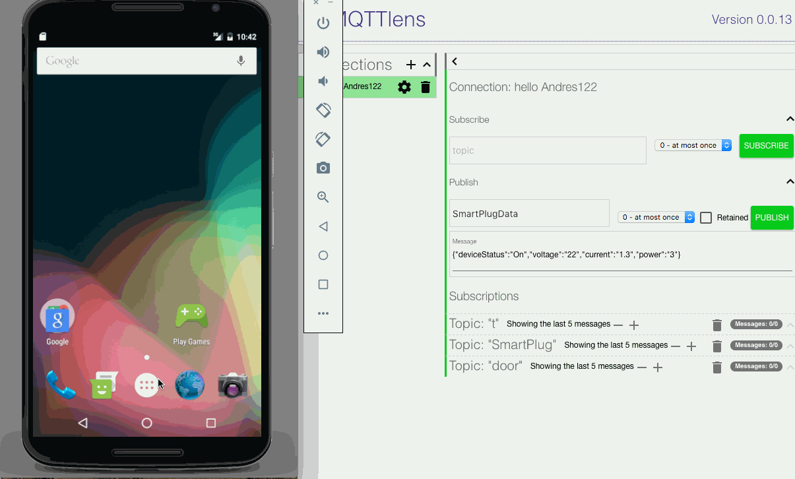

#Project SmartPlug

####Android application turns on/off hardware device, also gets data (V,I,P) from device and displays values in the app.

Device design and develop by [hardware team](https://github.com/hsrascon/SmartPlug/blob/master/Firmware/WL1/ArduinoCode/SmartPlugWL1_V04.ino).

###Device subscribes to Topic (app driven).

1. Device subscribes to Topic: "**SmartPlug**".
2. App sends below messages to turn on/off device.

Send On command to device:
`myMQTT.sendMessage("{\"command\":\"On\"}");`

Send Off command to device:
`myMQTT.sendMessage("{\"command\":\"Off\"}");`

###App subscribes to Topic (device driven).
1. Android app subscribes to Topic: "**SmartPlugData**".
2. Receives this message:
 `{"deviceStatus":"On","voltage":"22","current":"1.3","power":"3"}`
3. App parses message and displays values in the app

###Test App
To test Android app functionality I'm using Chrome plugin [MQTTLens](https://chrome.google.com/webstore/detail/mqttlens/hemojaaeigabkbcookmlgmdigohjobjm?hl=en),
it lets you:

    - create a topic and send messages
    - subscribe to topic and receive messages.

## Video Walkthrough 

Demo:

GIF created with [LiceCap](http://www.cockos.com/licecap/).

[CloudMQTT Console](https://api.cloudmqtt.com/sso/cloudmqtt/websocket)

##Notes
