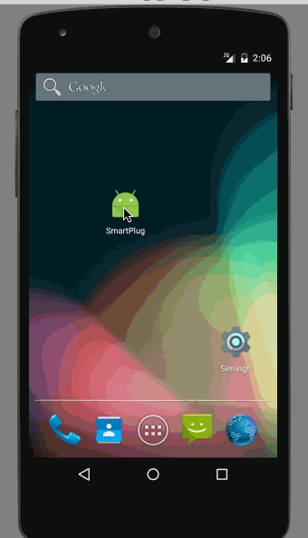

# Project SmartPlug

Documetation is WIP, currently is a draft...

This Android application turns on/off hardware device, also 
gets data (V,I,P) from device and displays values in the app

Device is being design and develop my team.

Device subscribes to Topic(app driven)
1. Device subscribes to Topic: SmartPlug
2. App sends below messages to turn on/off device
myMQTT.sendMessage("{\"command\":\"On\"}");
myMQTT.sendMessage("{\"command\":\"Off\"}");

App subscribes to Topic(device driven)
1. Once the Android app subscribes to Topic SmartPlugData
2. Receives this message {"voltage":"<>","current":"<>","power":"<>"}
3. App parses message and displays values in the app

To test app I'm using Chrome plugin [MQTTLens](https://chrome.google.com/webstore/detail/mqttlens/hemojaaeigabkbcookmlgmdigohjobjm?hl=en)
It lets you create a topic, subscribe to topic, send messages.
Easier and faster than using the Mqtt console.

## Video Walkthrough 

Demo:

GIF created with [LiceCap](http://www.cockos.com/licecap/).

[CloudMQTT Console](https://api.cloudmqtt.com/sso/cloudmqtt/websocket)

## Notes